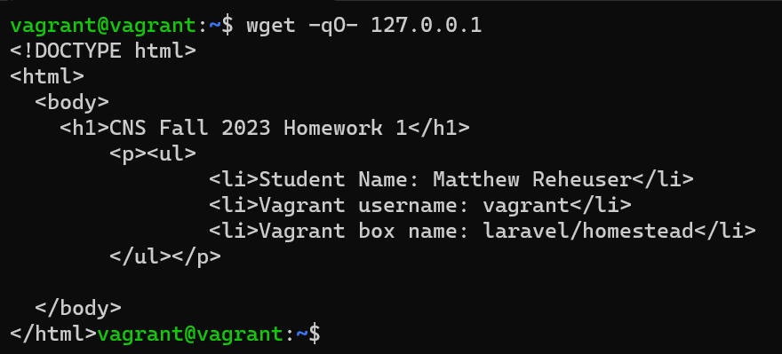
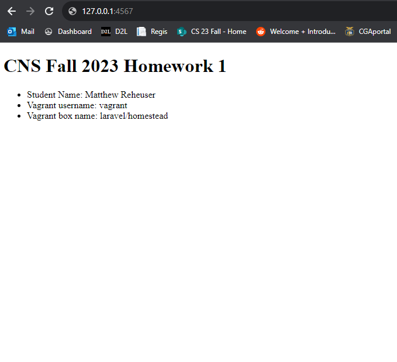
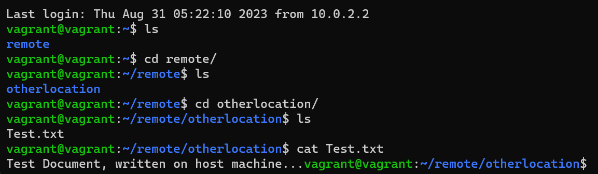

# 7330: Computer and Network Security
## Matthew Reheuser 
#### 2023.08.31 
&nbsp;

## Automate Web 
The first tutorial I followed was the Provision a Virtual Machine. This tutorial explained that provisioning a machine enabled a machine to be booted up exactly the same each time by running specific commands given to the machine upon boot. This then allows a machine to be passed between different computers and run exactly the same.  
This screenshot shows the apache2 server running on my Vagrant box which was added through a provision. 
&nbsp;

&nbsp;

## Configure Networking
For this part of the homework the tutorial I used was the Configure the Network tutorial. This tutorial allowed me to access the webserver run on the Vagrant box on my host computer.  
This screenshot shows the apache2 server which is running on the Vagrant box open on Google Chrome on my host machine. 
&nbsp;

 
&nbsp;

## Shell Vagrant Provisioner
The Shell provisioner is the fundamental Vagrant provisioner that executes scripts on the Vagrant box during the provisioning process. Shell provisioning involves issuing commands to the Unix shell within the Vagrant box to run tasks during provisioning. The Shell scripts can be written in Bash, a basic shell scripting language. When saving a file for shell provisioning, it would be saved as a .sh file. I chose shell provisioning for this homework because it was the most familiar method.
&nbsp;

## File Provisioner
I was successfully able to use the File Provisioner. I used the command: 
> config.vm.provision "file", source: "C:/Users/Matthew Reheuser/Desktop/VagrantFile", destination: "~/remote/otherlocation"  

This transfered over the folder located on my desktop over to a folder the provisioner created called otherlocation within another folder it created called remote within the home. 
&nbsp;

 
&nbsp;

