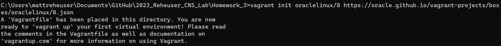
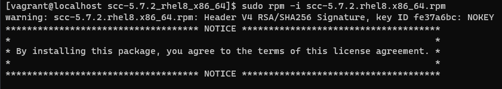
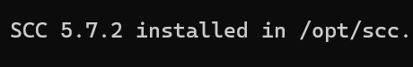
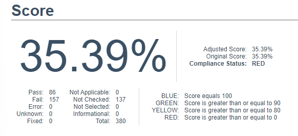
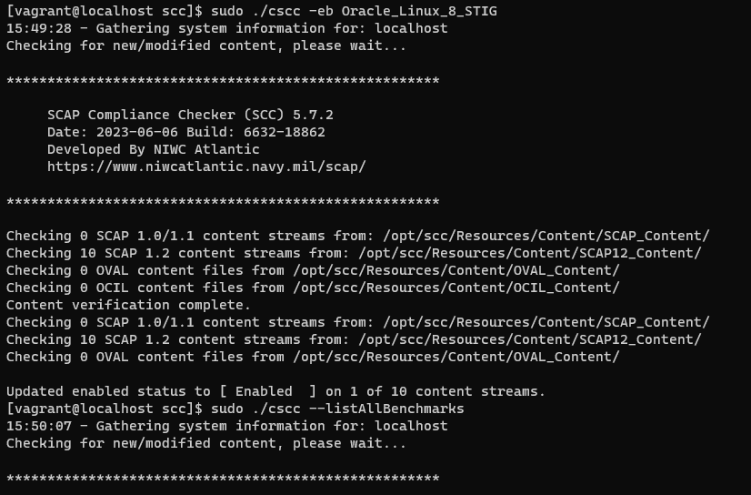

# 7330: Computer and Network Security Homework 3 
## Matthew Reheuser 
#### 2023.09.13 
&nbsp;

# Linux Information
I used the Oracle Linux 8 Linux distribution. I set up the Virtual machine as a Vagrant box, it was a very simple set up and provided a lot of benifits as I intially messed up the set up of the SCC and just destroyed and reloaded the Vagrant box to have a fresh install. I picked the Oracle Linux 8 distribution becuase that was the only OS I was familiar with that could run SCC.  
  

# Installing SCC 
I used the methods used in previous labs to get files to the Vagrant box. I placed the files in the Vagrant directory and they would be in the virtual machine. I used the Ret Hat Package Manager to install the SCC. Shown below as the "rpm -i" command. I originally had created a Oracle Linux 9 Distrubtion however realized that the installer only supported up to Oracle Linux 8. I thought it was helpful how it showed where SCC was installed so I could easily access it and confirm it installed properly. 
  
  

# Scan results from SCC
The overall score for the Oracle 8 Linux distrubtion was 35.39%, with 86 controls passing and 157 controls failing. There were 19 CAT I controls, passing 13 and failing 6.
  

# CSCC Running
CSCC was quicker than I expected to run the STIG on the operating system. Below is the CSCC tool running for the Oracle Linux 8 STIG.
  
