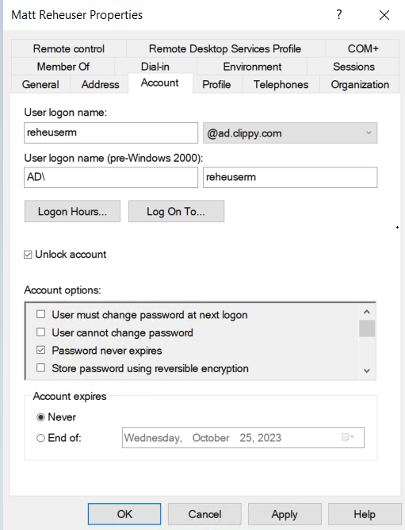
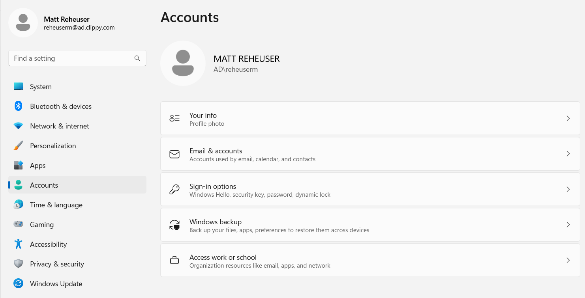
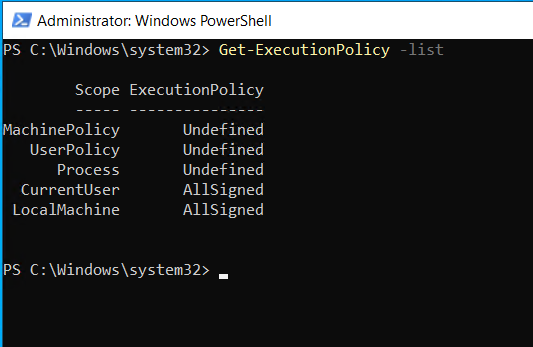
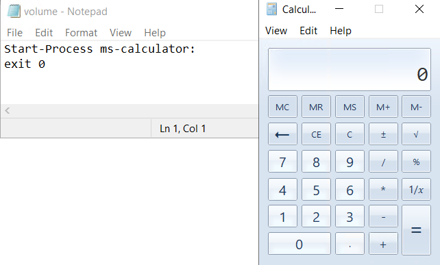
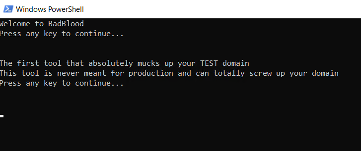
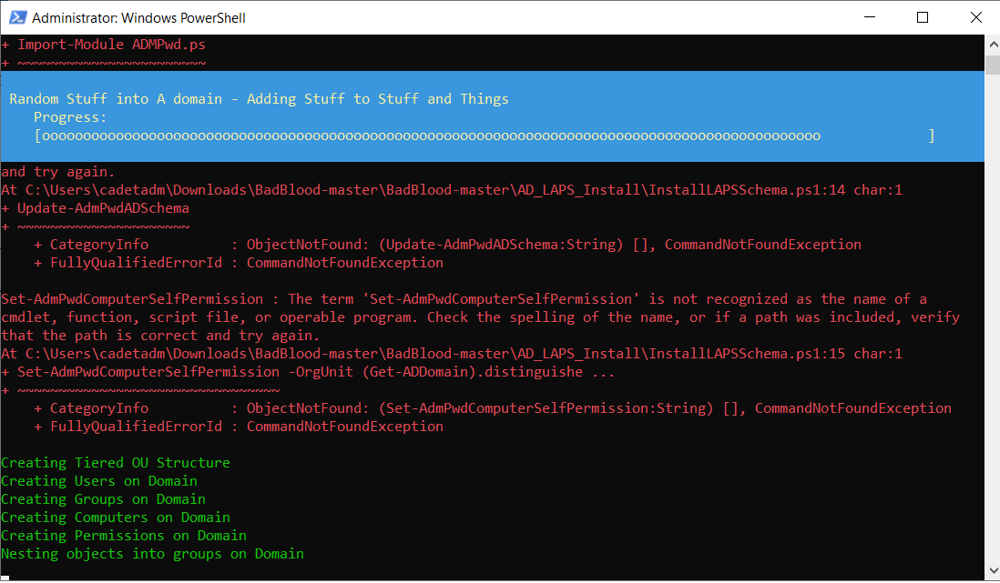
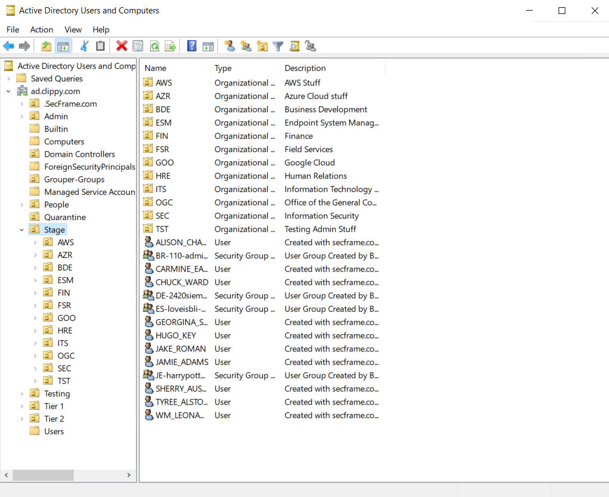

# 7330: Computer and Network Security Homework 4 
## Matthew Reheuser 
#### 2023.09.28 
&nbsp;

1. Creating a regular user account, in the Users OU, that does not have any administrative privileges. Taking a screenshot of the Member Of and Account tab in ADUC for their newly created user [1 points] 
&nbsp;

This first screenshot shows the account tab of a new user account named reheuserm. 

This shows the current member of tab which would be where privileged were given to the user. 

2. Taking a screenshot of the logon session information to show that the newly created user account from the previous step works as intended [1 points] 
&nbsp;

After creating the account as a user on the Domain Contoller I was able to sign into that account. As seen in the screenshot below I signed into reheuserm@ad.clippy.com

3. Setting a new execution policy on the DC, using the DA account, that allows for the execution of the Powershell script on the DC in the next section of the homework. Writing up a description of which execution policy was chosen, which scopes were edited, and why. Taking a screenshot of the output of Get-ExecutionPolicy -list [2 points] 
&nbsp;

Next we set up the execution policy on the Domain Contoller to be AllSigned. What that requires is that all scripts must be signed including locally written scripts. However we realized that we did not have any easy means of signing scripts and shifted to the RemoteSigned policy. That policy allows digital signatures on scripts that are downloaded. However, locally written scripts do not need to be signed. This is the recommended policy for windows computers. 

4. Creating their own unique Powershell script. Running their script on the DC and taking a screenshot of the output. Saving the script for submission to Github [2 points] 
&nbsp;

I created a powershell script that opens up the MS Calculator. While the script does not seem to do much I was demonstrating how a powershell script could be used to run unwanted software or programs. 

5. Documenting the changes to their AD environment. Creativity is encouraged here, and using the screenshots in the BadBlood repo are a good place to start. Things like number of users, example objects, etc are [3 points] 
&nbsp;
 
We ran BadBlood in order to treat our acticy directory like what a large company might have. This enabled us to see how a system like this may end up being strucutred. As seen from our ADUC a hanful of users, groups and organizational levels were added to the system. 

