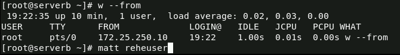
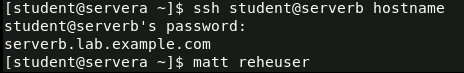
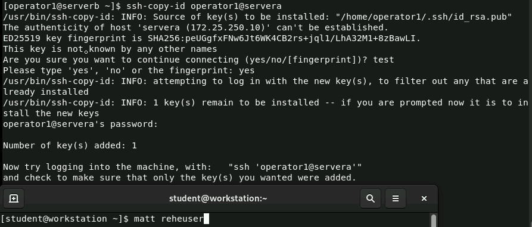
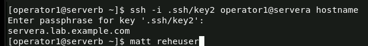
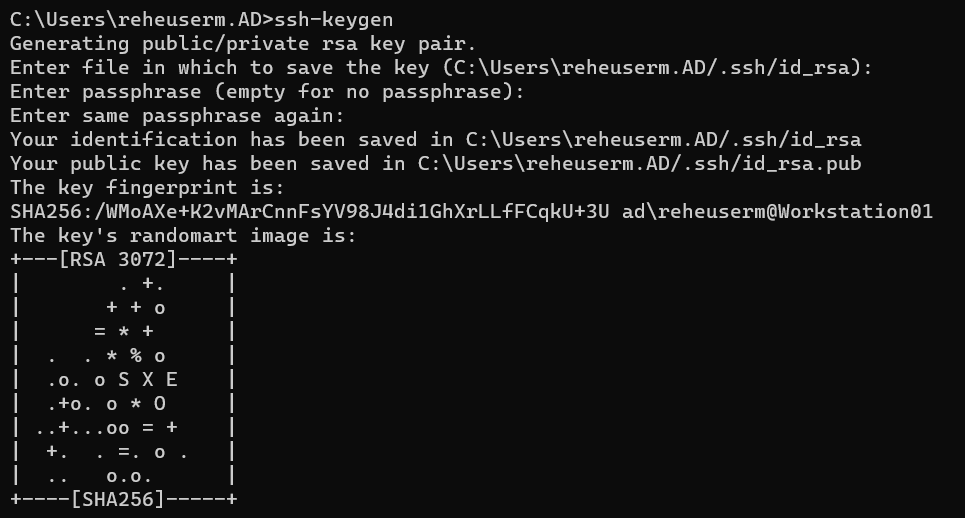
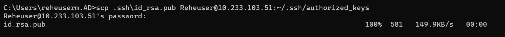
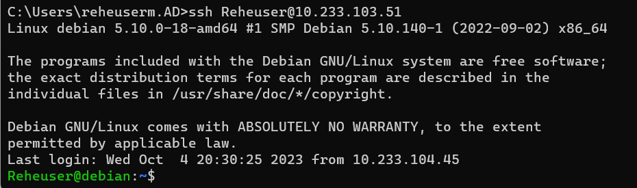
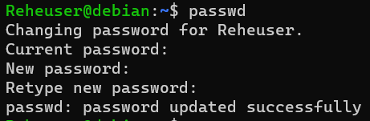
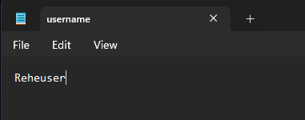
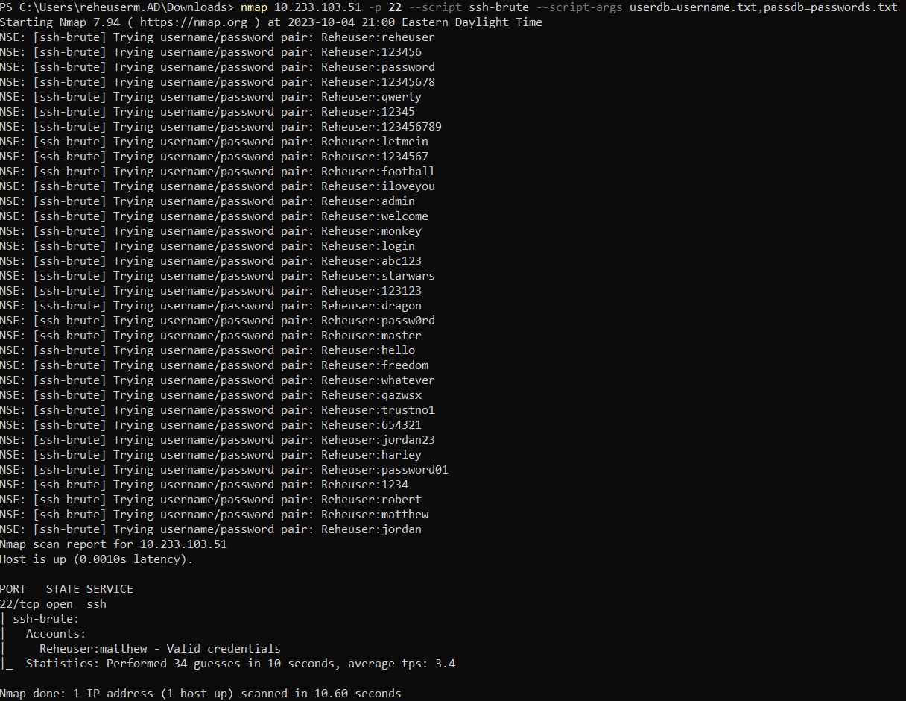

# 7330: Computer and Network Security Homework 5
## Matthew Reheuser 
#### 2023.10.29 
&nbsp;

1. 
• Take a screenshot of step #6 in Section 10.2 Guided exercise.  
This screenshot is showing the current computers and users that are connected using ssh.  
  
• Take a screenshot of step #12 in Section 10.2 Guided exercise.  
This is a means of connecting to serverb without having to enter the shell. This is demonstrating that I have access to serverb without having to input a password. The host key of serverb in the known_hosts folder.   
  
• Take a screenshot of step #4 in Section 10.4 Guided exercise.
  
• Take a screenshot of step #9 in Section 10.4 Guided exercise.
  
[4 points]

2. 
• Generate your own SSH keys 
  
• Share your public key to the Cybernet jump box from lab 6
  
• Login as your user using key based authentication
  
[3.5 points]

3. 
    1. Login to the jumpbox using your user name from Lab 6. Change the password using the passwd
    command to a password that exists in the password list.
      
    2. Use your existing user name as the user to brute for passwords. Depending on the tool, this may
    mean creating a “list” file of one user or providing the user name on the command line.
      
    3. Run your tool of choice (see notes) against the jumpbox to “discover” the password.
      

[1.5 points]

