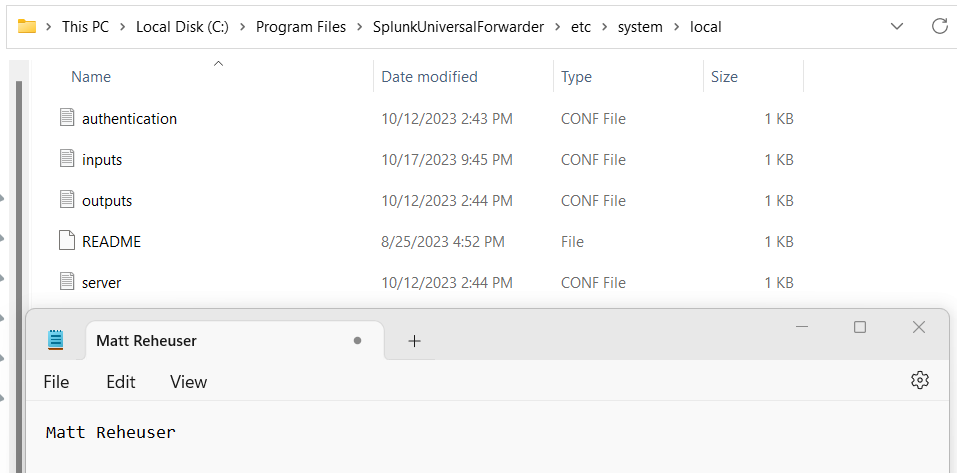

# 7330: Computer and Network Security Homework 6
## Matthew Reheuser  
#### 2023.10.18 
&nbsp;

### - Splunk training course   
I enrolled into the Splunk training course on getting data into Splunk. While this course was less on theory or explaining the why it was still a helpful course to look into. This course ended up being really applicable to understanding how different data can be inputted, what type of data can be added and then how to parse the data by Splunk. The first thing the course did was define the data pipeline, there are four segements and they are: input, parse, index and search. The whole course worked in the Splunk enterprise web app to show demonstrate the GUI way to create and define ways for data to be inputted into Splunk. While in class we are not using the GUI, seeing the different options for the selections of that data input types was helpful to deepen my understanding on how that may be inputted. The GUI just ended up writing the input.conf file to define what was requested of the GUI. I learned about what data types can be defined in the input.conf to get data into Splunk. The data types are files and directories, network events, scripted outputs, Linux and Windows sources, HTTP(s) protocol, and metrics. Overall I felt that this course offered a good understanding on how Splunk works with data and is able to utilize the data pipeline to get data from a source to be searched. 

### - Windows Event ID 

The Windows event ID I blacklisted from our splunk was 4624. 4624 is the event ID thaty gets passed when there is a successful login. The reason we choose to exclude that ID was because we though that information by itself was something that could produce a lot of logs while not adding much functionality for our team.  

### - Input.conf
The input.conf file is located within the etc/system of the SplunkUniversalForwarder. The etc folder is used to store system configuration files which makes sense for having the input configuration file in there. 
  

