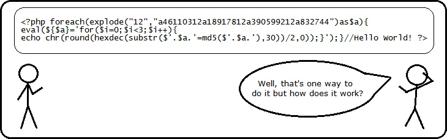

# 7330: Computer and Network Security Homework 7
## Matthew Reheuser  
#### 2023.10.26 
&nbsp;

### - Vulnerable service
While searching for a vulnerable service I decided to look at port 80, which is HTTP. Starting with the Metasploitable box I saw the version of Apache running on that box and looked up exploits associated with that version. The Metasploitable box was running an Apache server version 2.2.8 for Ubuntu. There were a handul of exploits available for this version of Apache. The one I would be targetting the PHP services for Apache. Using the ip/phpinfo.php shows that the Apache server is running PHP version 5.2.4. There is a Metasploit expliot that expliots that version of PHP, exploit/multi/http/php_cgi_arg_injection. This exploit will give a meterpreter shell. This is preformed because that version of PHP is vulnerable to argument injection where there is no unescaped "=" the string is split on "+" characters passing to a function that escapes the shell metacharacters and passes it to the CGI binary. I found this picture below while exploring the exploit and it describes what is happening. 
   

Sources:   
https://www.rapid7.com/db/modules/exploit/multi/http/php_cgi_arg_injection/  
https://medium.com/hacker-toolbelt/metasploitable-2-iv-port-80-5b90a0a22cb6

### CVE Details
The corresponding CVE to the exploit I plan on pursing is CVE-2012-1823. This CVE has to do with PHP having inproper validation for inputs into the CGI script that lets command line options be placed inside the CGI script. The CWE assosiated with this is CWE-20 Improper Input Validation. This is a prime example of an input not being validated before it uses it and letting an attacker get access to shell.

Sources:  
https://nvd.nist.gov/vuln/detail/CVE-2012-1823  

