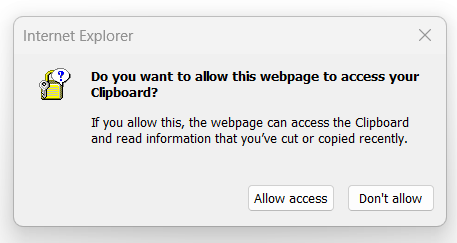

# 7330: Computer and Network Security Homework 8
## Matthew Reheuser  
#### 2023.11.16 
&nbsp;

### Research a Security Tool
I researched the security tool called BeEF, BeEF stands for "The Browser Exploitation Framework". BeEF focuses on targetting cross site scripting vulnerabilities on websites to hook and take control of a browser to then utilize different vulnerabilites on that browser. The software is primary written in ruby with other languges used for specific tools for primary use on Unix. As an open source project, BeEF is located Gitub at https://github.com/beefproject/beef/tree/master. The tool looks for and examines vulnerabily web browsers after they have been hooked through the user going to a vulnerable website. From there the different tools can be run depending as to what version and type the browser is. Through my research, Internet explorer is the must vulnerable, Microsoft edge being slightly more secure, and then Chrome and Firefox being the most secured from attacks. However based on extensions running additional attacks can be conducted. 
  
This screenshot shows BeEF runninng with the hooked browsers showing on the left side. The details about the current browser being shown, showing that it is a linux machine operating on a virtual machine on port 172.25.1.177, running Firefox.  

### Demonstrate Use of the Chosen Tool
The first step for using BeEF is establishing a vulnerable web server. I created a simple looking webserver using apache2 on 172.25.1.171. This webserver has the script running which is the hook to BeEF running on my Kali linux box on 172.25.1.189 using port 3000. While the website is very simple, any compromised website could include that single line of html code to attack browsers.
  
  
  
I went to the ip 172.25.1.189 on my windows machine and as soon as I went to that website I was hooked back to the BeEF application running on my Kali linux box.  
  
After getting the browser hooked the first thing I did was maintaining persistance. The first thing I did was run the Man in the Browser attack which would help me remain persistance by keeping the browser connected through the BeEF tool.
  
After that persistance to the browser I wanted to ensure the user would not close their browser so I made it so the browser would show a pop up message if the user tried to close it. Really making sure I could accomplish what I needed to before the victim closed out their window.  
  
  
Now that persistance was established I began attempting other modules on the victims browser. I preformed a port scan to see what ports were available to see if there was anythin else I could target on the host computer. I was able to get the users current clipboard, which could be used to gain passwords for websites. Attempted a phishing attempt on the host using a Gmail login which passed back the information inputted back to BeEF.  
  
  
  
  
In addition to those attacks I attempted using other browsers to see if different modules were available and was unable to download a version of Internet explorer on the current versions of windows I had. I know that older versions are being run by many people which opens the door to remote execution. Overall this attack was very cool because it was something that I was able to see and something that I could really setup and run against an unknowning host with little additional work. 

